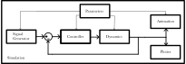
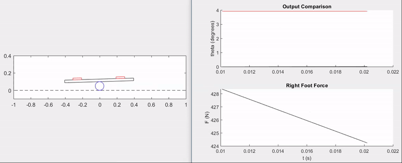

# Board Balancing Technical Project

## Motivation

I carried out this project in a cabin during Thanksgiving break with my family. I was in the middle of my first official Controls course, and I guess my excitement for the subject prompted me to dedicate some time to mathematical derivations and programming instead of the mountains and the hot tub...

## Model Description

Basically, the challenge is to have a person balance on top of a board, which in turn is balancing on top of a cylinder (like a two liter bottle or something). I made this physical setup with an old skateboard for fun and to improve my balance in dynamic situations.

**Schematic:**


**Assumptions:**

- There is no slip between the ground, the cylinder, and the board.
- The finite weight of the person balancing on the board can be shifted between the two feet with negligible rotational inertia effects from the shifting.
- Motion confined to the plane.
- All objects in the system act as rigid bodies.

**Equations of Motion and Controller Derivation:**

I used the Euler-Lagrange method to model the dynamics of the board balancing system, and decided to try using a state space feedback controller with an integrator to control the system to commanded cylinder rotation angles.

All of my work and the final dynamics/controller equations can be found in [the notes I made over Thanksgiving break](./Board Balancing.pdf). I thought it would be fun to include my hand-written notes to demonstrate both my meandering efforts and the way I like to take notes on all kinds of subjects. There are a lot of colors and pasted images involved, as I prefer to gather information from all around the internet to fill in emergent gaps in my understanding as I go.

## Matlab Implementation



To test out my derived dynamics and controller, I created a simulation in Matlab that models the dynamics of the board balance system and controls it to commanded cylinder angle values. The following sections give code listings for all of the blocks in the above block diagram.

### Parameters

This code defines all physical parameters for the system, the linearized state space model, the controller parameters, and the signal and animation parameters.

```matlab
% Physical Parameters
P.mp = 2;   % mass of plank (kg)
P.mb = 3;   % mass of bottle (kg)
P.g = 9.81; % gravity (m/s^2)
P.dL = 0.25;  % distance from left foot to plank center (m)
P.dR = P.dL;  % distance from right foot to plank center (m)
P.wp = 0.8; % width of plank (m)
P.hp = 0.03;% thickness of board (m)
P.Rb = 0.05; % radius of bottle (m)
P.Ft = 800; % my weight (N)

P.Jb = 1/2*P.mb*P.Rb^2;
P.Jp = 1/12*P.mp*(P.wp^2 + P.hp^2);

% Linearized State-Space Model
P.A = [0 1 0 0;P.Ft*P.Rb/P.Jp 0 P.Ft*P.Rb/P.Jp 0;...
       0 0 0 1;(P.Ft+P.g*P.mp)*P.Rb/P.Jb 0 0 0];
P.B = [0; -(P.dL+P.dR)/P.Jp; 0; 0];
P.C = [0 0 1 0];
n = rank(P.A);

% Full state feedback gains
wnthetab = 40;
wnphi = 10*wnthetab;
zeta = 1/sqrt(2);
desiredPoly = conv([1 2*zeta*wnthetab wnthetab^2],[1 2*zeta*wnphi wnphi^2]);
Ahat = [P.A zeros(n, 1);-P.C 0];
Bhat = [P.B; 0];
K = place(Ahat, Bhat, [roots(desiredPoly); -5]);
P.K = K(1:n);
P.Ki = K(end);

% Saturation limits
buffer = P.Ft;%/2; % the maximum you can go
P.umax = P.Ft/2 + buffer;
P.umin = P.Ft/2 - buffer;

% Animation Parameters
P.footW = .1;   % width of foot (m)
P.footH = .02;  % height of shoe sole (m)
P.floorL = 2;   % length of sim floor (m)
P.ceilH = 0.4;  % height of sim ceiling (m)

% Simulation Parameters
P.phi0 = 0.0;
P.phidot0 = 0.0;
P.thetab0 = 0.0;
P.thetabdot0 = 0.0;

P.t0 = 0.0;
P.tf = 10.0;
P.Ts = 0.0001;
P.t_plot = 100*P.Ts; %0.0001;

P.r_amp = 20*pi/180;
P.r_freq = 1;
```

### Signal Generator

This code defines functions for generating a signal for the commanded cylinder angle, \\(\theta_C\\). It defines methods for a square wave, a sawtooth wave, a sine wave, and a random signal.

```matlab
classdef signalGenerator
    % produces waves: square, sawtooth, random, sin
    properties
        amplitude
        frequency
        y_offset
    end
    methods
        % constructor ===================================================
        function self = signalGenerator(amplitude, frequency, y_offset)
            self.amplitude = amplitude;
            if nargin > 1
                self.frequency = frequency;
            else
                self.frequency = 1;
            end
            if nargin > 2
                self.y_offset = y_offset;
            else
                self.y_offset = 0;
            end
        end
        % signal outputs ================================================
        function out = square(self, t)
            % if in first half of period, output positive, else negative
            if mod(t, 1/self.frequency) <= 0.5/self.frequency
                out = self.amplitude + self.y_offset;
            else
                out = -self.amplitude + self.y_offset;
            end
        end
        function out = sawtooth(self, t)
            out = 4*self.amplitude*self.frequency * mod(t, 0.5/self.frequency)...
                - self.amplitude + self.y_offset;
        end
        function out = random(self, t)
            out = sqrt(self.amplitude)*randn + self.y_offset;
        end
        function out = sin(self, t)
            out = self.amplitude*sin(2*pi*self.frequency*t) + self.y_offset;
        end
    end
end
```

### Data Plotter

This code creates plots that update in real time with important information about the performance of the system.

```matlab
classdef plotData < handle
    properties
        % data histories
        time_history
        thetab_history
        thetab_r_history
        F_history
        index
        % figure handles
        thetab_r_handle
        thetab_handle
        F_handle
    end
    methods
        %--constructor--------------------------
        function self = plotData(P)
            % Instantiate lists to hold the time and data histories
            n = ceil((P.tf-P.t0)/P.t_plot);
            self.time_history = NaN*ones(1,n);
            self.thetab_history = NaN*ones(1,n);
            self.thetab_r_history = NaN*ones(1,n);
            self.F_history = NaN*ones(1,n);
            self.index = 1;

            % Create figure and axes handles
            figure(2), clf
            subplot(2, 1, 1)
                hold on
                self.thetab_r_handle = plot(self.time_history, self.thetab_r_history, 'r');
                self.thetab_handle = plot(self.time_history, self.thetab_history, 'k');
                ylabel('theta (degrees)')
                title('Output Comparison')
            subplot(2, 1, 2)
                hold on
                self.F_handle = plot(self.time_history, self.F_history, 'k');
                ylabel('F (N)')
                xlabel('t (s)')
                title('Right Foot Force')
        end
        %----------------------------
        function self = updatePlots(self, t, thetab_r, thetab, F)
            % update the time history of all plot variables
            self.time_history(self.index) = t;
            self.thetab_r_history(self.index) = thetab_r;
            self.thetab_history(self.index) = thetab;
            self.F_history(self.index) = F;
            self.index = self.index + 1;

            % update the plots with associated histories
            set(self.thetab_r_handle, 'Xdata', self.time_history, 'Ydata', self.thetab_r_history)
            set(self.thetab_handle, 'Xdata', self.time_history, 'Ydata', self.thetab_history)
            set(self.F_handle, 'Xdata', self.time_history, 'Ydata', self.F_history)
        end
    end
end
```

### Animation

This code draws the board balancing system, dynamically updating the drawing to create an animation based on the current state in the simulation.

```matlab
classdef animation
    properties
        plank_handle
        left_foot_handle
        right_foot_handle
        bottle_handle
        floorL
        ceilH
        footW
        footH
        dL
        dR
        wp
        hp
        Rb
    end
    methods
        % constructor ===================================================
        function self = animation(P)
            self.floorL = P.floorL;
            self.ceilH = P.ceilH;
            self.footW = P.footW;
            self.footH = P.footH;
            self.dL = P.dL;
            self.dR = P.dR;
            self.wp = P.wp;
            self.hp = P.hp;
            self.Rb = P.Rb;

            figure(1), clf

            % draw wall and floor
            plot([-self.floorL/2, -self.floorL/2, self.floorL/2],[self.ceilH, 0, 0],'k--');
            hold on

            % initialize mass, spring, and damper
            self = self.drawPlank(P.phi0, P.thetab0);
            self = self.drawLeftFoot(P.phi0, P.thetab0);
            self = self.drawRightFoot(P.phi0, P.thetab0);
            self = self.drawBottle(P.thetab0);

            % change axis limits
            axis([-self.floorL/2, self.floorL/2, -0.1, self.ceilH]);
            pbaspect([self.floorL, self.ceilH+.1, 1]);
        end
        % drawing methods ===============================================
        function self = drawSystem(self, substate)
            phi = substate(1);
            thetab = substate(2);
            self = self.drawPlank(phi, thetab);
            self = self.drawLeftFoot(phi, thetab);
            self = self.drawRightFoot(phi, thetab);
            self = self.drawBottle(thetab);
            drawnow
        end
        function self = drawPlank(self, phi, thetab)
            % untransformed coordinates, row vector of (x,y) coords
            X = [-self.wp/2, self.wp/2,  self.wp/2, -self.wp/2, -self.wp/2;...
                  self.hp/2, self.hp/2, -self.hp/2, -self.hp/2,  self.hp/2];
            % rotate by phi
            R = [cos(phi) -sin(phi);sin(phi) cos(phi)];
            X = R*X;
            % translate
            X = X + self.Rb*[-thetab-(sin(phi)+thetab*cos(phi));1+cos(phi)-thetab*sin(phi)]...
                + [0;self.hp/2];
            % draw
            if isempty(self.plank_handle)
                self.plank_handle = plot(X(1,:), X(2,:), 'k');
            else
                set(self.plank_handle, 'XData', X(1,:), 'YData', X(2,:));
            end
        end
        function self = drawLeftFoot(self, phi, thetab)
            % untransformed coordinates, row vector of (x,y) coords
            X = [-self.footW/2, self.footW/2,  self.footW/2, -self.footW/2, -self.footW/2;...
                  self.footH/2, self.footH/2, -self.footH/2, -self.footH/2,  self.footH/2];
            % translate
            X = X + self.Rb*[-thetab-(sin(phi)+thetab*cos(phi));1+cos(phi)-thetab*sin(phi)]...
                + [-self.dL;self.hp + self.footH/2];

            % rotate by phi
            R = [cos(phi) -sin(phi);sin(phi) cos(phi)];
            X = R*X;

            % draw
            if isempty(self.left_foot_handle)
                self.left_foot_handle = plot(X(1,:), X(2,:), 'r');
            else
                set(self.left_foot_handle, 'XData', X(1,:), 'YData', X(2,:));
            end
        end
        function self = drawRightFoot(self, phi, thetab)
            % untransformed coordinates, row vector of (x,y) coords
            X = [-self.footW/2, self.footW/2,  self.footW/2, -self.footW/2, -self.footW/2;...
                  self.footH/2, self.footH/2, -self.footH/2, -self.footH/2,  self.footH/2];
            % translate
            X = X + self.Rb*[-thetab-(sin(phi)+thetab*cos(phi));1+cos(phi)-thetab*sin(phi)]...
                + [self.dR;self.hp + self.footH/2];

            % rotate by phi
            R = [cos(phi) -sin(phi);sin(phi) cos(phi)];
            X = R*X;
            % draw
            if isempty(self.right_foot_handle)
                self.right_foot_handle = plot(X(1,:), X(2,:), 'r');
            else
                set(self.right_foot_handle, 'XData', X(1,:), 'YData', X(2,:));
            end
        end
        function self = drawBottle(self, thetab)
            th = 0:pi/50:2*pi;
            X = self.Rb*cos(th) - self.Rb*thetab;
            Y = self.Rb*sin(th) + self.Rb;

            if isempty(self.bottle_handle)
                self.bottle_handle = plot(X, Y, 'b');
            else
                set(self.bottle_handle, 'XData', X, 'YData', Y);
            end
        end
    end
end
```

### Dynamics

This code defines the nonlinear, coupled differential equations which describe the evolution of the board balancing system given an input, which is the distribution of shifted weight of the human "pilot" between the two feet.

```matlab
classdef dynamics < handle
    %  Model the physical system
    %----------------------------
    properties
        state
        mp
        mb
        g
        dL
        dR
        Rb
        Ft
        Jb
        Jp
        Cmat
        Ts
    end
    %----------------------------
    methods
        %---constructor-------------------------
        function self = dynamics(P)
            % Initial state conditions
            self.state = [...
                        P.phi0;...                
                        P.phidot0;...
                        P.thetab0;...
                        P.thetabdot0
                        ];     
            self.mp = P.mp;
            self.mb = P.mb;
            self.g = P.g;
            self.dL = P.dL;
            self.dR = P.dR;
            self.Rb = P.Rb;
            self.Ft = P.Ft;
            self.Jb = P.Jb;
            self.Jp = P.Jp;
            self.Cmat = P.C;
            self.Ts = P.Ts;
        end
        %----------------------------
        function self = propagateDynamics(self, u)
            % Integrate ODE using Runge-Kutta RK4 algorithm
            k1 = self.derivatives(self.state, u);
            k2 = self.derivatives(self.state + self.Ts/2*k1, u);
            k3 = self.derivatives(self.state + self.Ts/2*k2, u);
            k4 = self.derivatives(self.state + self.Ts*k3, u);
            self.state = self.state + self.Ts/6 * (k1 + 2*k2 + 2*k3 + k4);
        end
        %----------------------------
        function xdot = derivatives(self, state, u)
            Fr = u;
            phi = state(1);
            phidot = state(2);
            thetab = state(3);
            thetabdot = state(4);
            phiddot = (self.Ft-Fr)/self.Jp*(self.dL + self.Rb*(sin(phi)+thetab*cos(phi)))...
                - Fr/self.Jp*(self.dR - self.Rb*(sin(phi)+thetab*cos(phi)));
            thetabddot = self.Rb/self.Jb*(self.Ft + self.mp*self.g)*sin(phi);
            xdot = [phidot; phiddot; thetabdot; thetabddot];
        end
        %----------------------------
        function y = getOutput(self)
            y = self.Cmat * self.state;
        end
        %----------------------------
        function xs = getSubState(self)
            phi = self.state(1);
            thetab = self.state(3);
            xs = [phi; thetab];
        end
        %----------------------------
        function x = getState(self)
            x = self.state;
        end
    end
end
```

### Controller

This code implements a full-state feedback controller with an integrator:

$$ F = F_e - Kx - k_i\zeta_e $$

as well as input saturation and integrator anti-windup. The integrator term allows for the full-state feedback system to act as a controller instead of just a regulator, accepting non-zero values for \\(\theta_C\\).

```matlab
classdef controller < handle
    %  Implements full-state feedback control without an integrator or
    %  saturation
    %----------------------------
    properties
        param
        zeta_e
        error_km1
    end
    %----------------------------
    methods
        %----------------------------
        function self = controller(P)
            self.param = P;
            self.zeta_e = 0;
            self.error_km1 = 0;
        end
        %----------------------------
        function F = u(self, y_r, x)
            % Calculate equilibrium force due to linearization
            Fe = self.param.Ft*(self.param.dL + self.param.Rb*x(3))/(self.param.dR+self.param.dL);
            % Integrate the error to update zeta_e
            self.integrateError(y_r - self.param.C*x);
            % Calculate the unsaturated force using state
            F_unsat = Fe - self.param.K*x - self.param.Ki*self.zeta_e;
            % Saturate input
            F = self.sat(F_unsat);
            % Implement anti-windup
            if self.param.Ki ~= 0
                self.zeta_e = self.zeta_e + 1/self.param.Ki*(F - F_unsat);
            end
        end
        %----------------------------
        function F_sat = sat(self, u)
            F_sat = u;
            if u > self.param.umax
                F_sat = self.param.umax;
            elseif u < self.param.umin
                F_sat = self.param.umin;
            end
        end
        %----------------------------
        function self = integrateError(self, error)
            self.zeta_e = self.zeta_e + self.param.Ts/2*...
                (error + self.error_km1);
            self.error_km1 = error;
        end
    end
end
```

### Simulator

This code puts everything together in a simulation loop.

```matlab
param;

SYS = dynamics(P);
CNTRL = controller(P);
ANMTN = animation(P);

thetabRef1 = signalGenerator(pi, 0.5);
thetabRef2 = signalGenerator(pi/4, 0.25);

dataPlot = plotData(P);

% main simulation loop
t = P.t0;
while t < P.tf  
    r = thetabRef1.square(t) + thetabRef2.square(t);
    t_next_plot = t + P.t_plot;
    while t < t_next_plot
        u = CNTRL.u(r, SYS.getState());
        SYS.propagateDynamics(u);
        t = t + P.Ts;
    end
    dataPlot.updatePlots(t, r, SYS.getOutput(), u);
    ANMTN.drawSystem(SYS.getSubState());
    pause(P.t_plot)
end
```

## Simulation Results

The animation and plots below demonstrate the ability of the feedback controller to track step commands without overshoot and with a rise time of \\(\approx 0.5\\) seconds.



Surely, there is a lot more that could have been done with this setup, from model validation to implementing disturbances and more advanced control techniques--perhaps even nonlinear control. That being said, this was primarily a fun exercise and an opportunity to apply the principles of my first controls course from the ground-up.

This project is a good example of the type of work that I most enjoy, which entails full-fledged analysis of a system and writing algorithms to leverage that understanding to make things happen. Math, engineering, and programming knowledge are all required in such projects, which is probably why I find them to be so stimulating.
