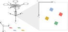

---
# Feel free to add content and custom Front Matter to this file.
# To modify the layout, see https://jekyllrb.com/docs/themes/#overriding-theme-defaults

layout: home
title: "6-DOF Camera Extrinsics Calibration"
sidebar:
  nav: "docs"
---

$$\ddagger$$ [Link to Github Repository](https://github.com/goromal/camera-extrinsics-calibrator) $$\ddagger$$
* * *

# Motivation and Description

Many autonomous agents such as unmanned air vehicles (UAV) leverage the fusion of visual and inertial odometry measurements for real-time state estimation and control. In order for visual-inertial odometry to be effective, it is imperative that the rigid body transform between the vision sensor (usually a camera) and the inertial measurement unit (IMU) be known precisely. Currently, ascertaining that transform usually entails a cumbersome calibration process for backing out the translation and rotation between the camera and IMU frame. Given a flight path with both camera measurements of static landmarks of known locations and inertial measurements, however, an optimization routine may be formulated which automates this process, performing an extrinsic camera calibration from measurement data. Visual landmarks with known locations can be obtained with fiducial markers such as the [ArUco tag](https://www.uco.es/investiga/grupos/ava/node/26).

As an undergraduate research project that I completed during my senior year, I designed and implemented an optimization routine that uses camera and IMU measurements taken during a single flight to estimate the extrinsic parameters of a camera used for visual-inertial odometry. The routine is similar to optimizing over a pose graph, which is famously utilized in simultaneous localization and mapping (SLAM) applications.

# The Math

## Definitions

To understand everything the algorithm is doing, a lot of terms need to be defined (sorry)...

All vector quantities in the camera extrinsics calibration problem are expressed in one of the following frames:

- **The inertial/global frame ($$\mathcal{I}$$):** This is the north-east-down (NED) frame, assumed to be stationary over the course of the calibration routine.
- **The UAV body frame ($$\mathcal{B}$$):** This frame is body-centric and body-fixed to the UAV. The x-axis sticks out the front of the UAV, the y-axis out the right side, and the z-axis out the bottom, towards the ground.
- **The camera frame ($$\mathcal{C}$$):** This frame is centered on the pinhole convergence point of the camera attached to the UAV. From the perspective of the camera image, the x-axis sticks out to the right, the y-axis points down, and the z-axis points out of the camera plane toward the world.
- **The camera pixel frame ($$\mathcal{C}_\mathcal{P}$$):** This frame coincides with the camera frame in terms of orientation, but is centered on the image plane, where units are measured in pixels.

Additionally, the following vectors in $$\mathbb{R}^n$$ and manifold objects (read my [paper](../DynamicsAndControl/Lie LQR SO2.pdf) on Lie Algebra math!) in $$\mathbb{S}^3$$ (the space of unit-length quaternions, though the following equations will use their rotation matrix counterparts instead, for clarity) are relevant to the calculations in the algorithm:

- $$^\mathcal{B}x_{\mathcal{C},0} \in \mathbb{R}^3$$: The **initial guess** for the translational offset between the origin of the UAV body frame and the origin of the camera frame. Expressed in the body frame.
- $$q_{\mathcal{B},0}^\mathcal{C} \in \mathbb{S}^3$$: The **initial guess** for the (passive) rotational offset between the UAV body frame and the camera frame.
- $$^\mathcal{B}x_{\mathcal{C},f} \in \mathbb{R}^3$$: The **calculated** translational offset between the origin of the UAV body frame and the origin of the camera frame, as a result of the optimization routine. Expressed in the body frame.
- $$q_{\mathcal{B},f}^\mathcal{C} \in \mathbb{S}^3$$: The **calculated** (passive) rotational offset between the UAV body frame and the camera frame, as a result of the optimization routine.
- $$^\mathcal{I}x_\mathcal{B} \in \mathbb{R}^3$$: The translation vector of the UAV with respect to the initial origin at the current time step. Expressed in the inertial frame.
- $$q_\mathcal{I}^\mathcal{B} \in \mathbb{S}^3$$: The (passive) rotation of the UAV with respect to the inertial frame at the current time step.
- $$^\mathcal{I}l_i \in \mathbb{R}^3$$: The position of stationary visual landmark $$i$$ with respect to the inertial origin. Expressed in the inertial frame.
- $$^{\mathcal{C}_\mathcal{P}}p_i \in \mathbb{R}^2$$: The measured pixel coordinates $$\begin{bmatrix}u_i & v_i\end{bmatrix}^T$$ of landmark $$i$$ in the image plane. Expressed in the camera pixel frame.
- $$^{\mathcal{C}_\mathcal{P}}\hat{p}_i \in \mathbb{R}^2$$: The **theoretical** pixel coordinates $$\begin{bmatrix}\hat{u}_i & \hat{v}_i\end{bmatrix}^T$$ of landmark $$i$$ in the image plane, given the initial guess for the extrinsic camera parameters.
- $$f \in \mathbb{R}^2$$: The focal lengths $$\begin{bmatrix}f_x & f_y\end{bmatrix}^T$$ of the camera.
- $$c \in \mathbb{R}^2$$: The center pixels $$\begin{bmatrix}c_x & c_y\end{bmatrix}^T$$ of the camera's image plane.
- $$s \in \mathbb{R}^1$$: The skew of the camera, which defines horizontal shear of the pixels in the image plane.
- $$d \in \mathbb{R}^5$$: The camera's (radial) distortion parameters $$\begin{bmatrix}k_1 & k_2 & p_1 & p_2 & k_3\end{bmatrix}^T$$. See the radial distortion model subsection for a more detailed explanation.

In order for the optimization routine to be accurate, a reasonably high fidelity model of the camera sensor must be used in the calculations. The following sections define the camera model as well as the residual calculation for the nonlinear least-squares optimizer.

## Camera Model: Transforming to the Camera Frame

Given an inertial landmark position $$^\mathcal{I}l_i$$, the landmark coordinates are transformed into the camera frame, simultaneously translating the origin to coincide with the origin of the camera frame using rigid body homogeneous transform matrices $$H_a^b \in SE(3)$$. This requires projecting $$^\mathcal{I}l_i$$ into homogeneous coordinates $$^\mathcal{I}\mathbf{l}_i \in \mathbb{R}^4$$.

As a short review, a homogeneous matrix $$H_a^b$$ that transforms a point (expressed in homogeneous coordinates) from frame $$a$$ to frame $$b$$ is composed from the respective rotation matrix and translation vector:

$$H_a^b = \begin{bmatrix}R_a^b & R_a^{ba}x_b; & 0 & 1\end{bmatrix}$$.

Homogeneous matrices can be multiplied together to get a resultant transform matrix, as with rotation matrices. Thus, $$H_\mathcal{I}^\mathcal{C}$$ (or $$H(\mathcal{I}\rightarrow\mathcal{C})$$) can be created by creating homogeneous matrices from $$\mathcal{I}\rightarrow\mathcal{B}$$ and $$\mathcal{B}\rightarrow\mathcal{C}$$ and composing them together.

Thus, given the shorthand assignments

$$\chi =~^\mathcal{C}\mathbf{l}_{x,i}$$,

$$\gamma =~^\mathcal{C}\mathbf{l}_{y,i}$$,

$$\zeta =~^\mathcal{C}\mathbf{l}_{z,i}$$,

$$^\mathcal{C}\mathbf{l}_i = \begin{bmatrix} \chi & \gamma & \zeta & 1\end{bmatrix}^T$$,

$$ ^\mathcal{I}\mathbf{l}_i = \begin{bmatrix}^\mathcal{I}l_i & 1\end{bmatrix}^T $$

$$ ^\mathcal{C}\mathbf{l}_i = H(\mathcal{I}\rightarrow\mathcal{C})^\mathcal{I}\mathbf{l}_i $$

For convenience in subsequent operations, we project $$^\mathcal{C}\mathbf{l}_i$$ back onto $$\mathbb{R}^3$$ and divide all components by the z-component:

$$ ^\mathcal{C}l_i = \begin{bmatrix}\chi/\zeta & \gamma/\zeta & 1\end{bmatrix}^T $$

## Camera Model: Radial Distortion

In our camera measurement model, it is assumed that the UAV camera lens imposes some kind of radial distortion on measured pixel features:

 

Thus, in the model, radial distortion is applied to the point $$^\mathcal{C}l_i$$ before it is projected onto the camera pixel plane.

Given a *distorted* feature location in the camera frame $$^\mathcal{C}l_{i,d}$$, the corresponding *undistorted* feature location in the camera frame $$^\mathcal{C}l_i$$ is obtained according to the following radial undistortion model:

Given the shorthand assignments

$$\chi =~^\mathcal{C}l_{x,i}$$,

$$\gamma =~^\mathcal{C}l_{y,i}$$,

$$\mathcal{X} =~^\mathcal{C}l_{i,d,x}$$,

$$\mathcal{Y} =~^\mathcal{C}l_{i,d,x}$$,

$$ g = 1 + k_1(\mathcal{X}\mathcal{Y})^2 + k_2(\mathcal{X}\mathcal{Y})^4 + k_3(\mathcal{X}\mathcal{Y})^6 $$

$$ \chi = g(\mathcal{X} + 2p_1\mathcal{X}\mathcal{Y}+p_2\mathcal{X}^2(\mathcal{Y}^2+2)) $$

$$ \gamma = g(\mathcal{Y} + 2p_2\mathcal{X}\mathcal{Y}+p_1\mathcal{Y}^2(\mathcal{X}^2+2)) $$

To do the reverse and apply distortion to $$^\mathcal{C}l_i$$, the undistortion model must be inverted. The model cannot be inverted explicitly, so we iteratively invert it using [Newton's method of function minimization in multiple dimensions](https://en.wikipedia.org/wiki/Newton%27s_method#Nonlinear_systems_of_equations).

## Camera Model: Pinhole Projection

Having obtained the distorted feature location in the camera frame, a pinhole projection model is used to obtain the distorted feature *pixel* location in the camera image plane. The projection model comes from similar triangles and the definition of horizontal shear:

Given the shorthand assignments

$$\mathcal{X} =~^\mathcal{C}l_{i,d,x}$$,

$$\mathcal{Y} =~^\mathcal{C}l_{i,d,x}$$,

$$ u_i = f_x \mathcal{X} + s \mathcal{Y} + c_x $$

$$ v_i = f_y \mathcal{Y} + c_y $$

Giving the theoretical camera measurement $$^{\mathcal{C}_\mathcal{P}}\hat{p}_i$$.

## Residual Calculation

The calibration process uses nonlinear optimization techniques to minimize the following cost function:

$$ J = \sum_t^T\sum_i^Ne^2, $$

where the error is defined as the difference between the camera measurement $$^{\mathcal{C}_\mathcal{P}}p_i$$ and its theoretical, predicted counterpart for each landmark $$i$$ and time step $$t$$ in the flight trajectory. All actual camera measurements are given as inputs to the optimizer, which modifies its guess for the extrinsic camera parameters to minimize the cost function.

It is not necessary for a residual to be calculated at every possible $$(i,t)$$ combination for the optimization to work, though a wide breadth of measurements and a varied flight path increase the chances of convergence.

# The Code and the Experiments

The entire implementation of the above theory is found in my [Github repository](https://github.com/goromal/camera-extrinsics-calibrator), which contains the following:

- Fully functioning UAV simulator with camera and inertial sensors.
- Camera extrinsics calibrator.
- Matlab tools for visualization.

The main executable contains two unit tests. The first unit tests demonstrates the calibration process with a simulated UAV trajectory, and the second unit test performs the calibration with actual hardware data from a small UAV. The code base is straightforward to set up for anyone who has experience with CMake.

# Conclusions

Currently, it is assumed that the provided visual landmark positions are absolutely true, so they are held as constant parameters by the optimizer. This might be disadvantageous in practice. It is possible that setting the landmark positions as additional decision variables for the optimizer could amend things, though it would probably help to specify additional geometric constraints pertaining to the landmark positions to help the optimizer converge. Additionally, [*Ceres*](http://ceres-solver.org/), the optimizer library used in this calibration routine, has loss function tools for outlier rejection that have not currently been explored in this application and may be useful.

Taking on this project inspired me to delve more deeply into the world of computer vision and its connections to autonomy on all levels, from state estimation to control and higher-level reasoning.
