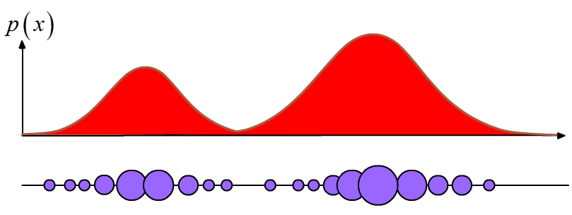
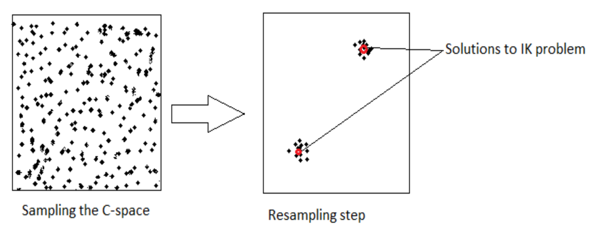
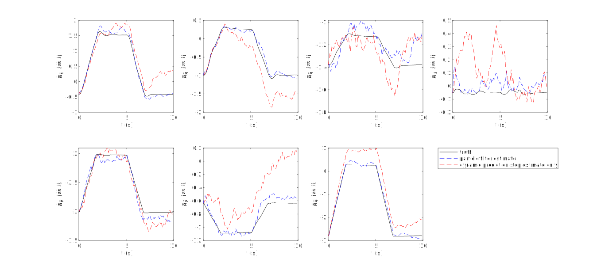
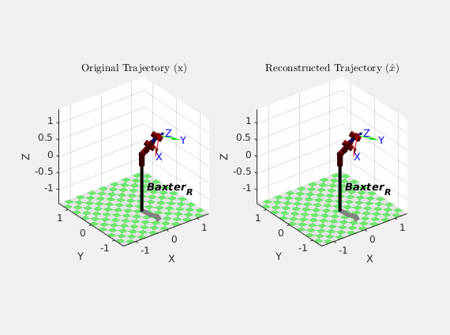

# 7-DOF Robot Arm Particle Filter

## Motivation

In robotics, the problem of finding an Inverse Kinematics (IK) solution given an end effector pose is one which requires solving non-linear equations whose solutions are often not unique. In fact, it is often not even possible to find an analytical solution when the number of degrees of freedom exceeds the dimensionality of the task space.

Moreover, "soft robots," or penumatically powered arms constructed from fabric or rubbery material, are gaining popularity in robotics research. They show promise for working alongside humans without posing a threat in the event of accidental collisions due to their pliability.


Without the use of a motion capture system, it is difficult to measure the joint positions of these robot arms directly, due to the absence of encoders.

The purpose of this project was to attempt to find a way to estimate the joint states of a robot using rudimentary dynamic models while dealing with the ambiguities inherent to the IK problem. My goal was to implement the joint state estimation algorithm on a rigid robot arm platform (named [Baxter](https://robots.ieee.org/robots/baxter/)) using methods that could be ported over to a soft robot arm platform in future work.

## The Particle Filter

For this project, I proposed the use of a Sampling Importance Resampling (SIR) particle filter to solve the IK problem for a physical 7-degree-of-freedom (7-DOF) robot arm over a trajectory given initial joint angles, (noisy) joint torque inputs, and end effector pose measurements.

The ability of the particle filter to represent multimodal belief states makes it well-suited to tackle the problem of estimating joint configurations, unlike tools such as the Kalman Filter, which requires beliefs to resemble Gaussian probability distributions. The filter represents arbitrary distributions non-parametrically with weighted clusters of particles, as shown below:



In that sense, the particle filter looks a little bit like a genetic algorithm.

Loosely, the particle filter resembles a typical Bayesian filter in that it computes a prior distribution by propagating a dynamic model (the very first belief state can be a uniform distributions with particles spread through the sample space), then computes a posterior distribution given a measurement at each time step. Importantly, however, the dynamic and measurement models need not be linear, and the computations are done on each individual particle.

As one can imagine, having a greater number of particles tends to lead to both better and slower results. Thus, after the update step has been applied, a resampling step can be carried out to replace outliers and decrease the computational load being wasted on propagating "unfruitful" particles. This is especially relevant for Bayesian filtering with a dynamic model (as opposed to static filtering), where many particles can become obsolete trying to hit a moving state-space target after only a few iterations. The update/resampling step is pictured below:



Putting everything together, the algorithm at each time step looks roughly like this:

```
1. Initialize particles concentrated around the given initial joint state in the joint configuration space
2. For each time step:
    3. Using the joint torques, propagate the particles forward in time with a dynamic model that has Monte Carlo-like variations in parameters for each particle (resembling mutation in a genetic algorithm)
    4. Calculate the forward kinematics of each particle and compare the result with the measured end effector pose
    5. Use the results from (4.) to assign new probability weights to each particle
    6. Resample and normalize particle weights as needed
```

## Experiment and Results

With the particle filter algorithm, I used the Baxter hardware platform to carry out a trajectory, collecting measurement data of the initial joint states, the end effector pose measurements, and the joint torques. For each time step in post-processing, the particle filter used the joint torques to predict the new joint configuration given the previous state, and the end effector pose measurements were used to refine the prediction in an update step. A resampling method was used to throw out outlier particles at each time step to decrease computation time. Additionally, I added noise to the joint torque input data to demonstrate the robustness of the filter.

Here are the results, which compare the performance of the full particle filter with the performance of simply using the dynamic model to calculate joint states from joint torques:



As an alternative illustration of the particle filter performance, here's an animation comparing how Baxter *actually moved* (\\(x\\)) over the course of the trajectory with how the particle filter *thought it moved* (\\(\hat{x}\\)) based on its estimates:



Though the results of the particle filter weren't perfect, they were certainly better than the dynamic model alone. It should also be noted that this was my first time designing, implementing, and tuning a particle filter, so that certainly could have skewed the results. It is also cool to note that because the particle filter did not have to invert any matrices in its algorithm, it behaved well near robot arm singularities.

All in all, the particle filter algorithm shows promise for future applications for soft robot arms and other platforms where dynamic input parameters (such as joint torques and velocities) and end effector pose measurements are more readily available than direct joint state measurements.
