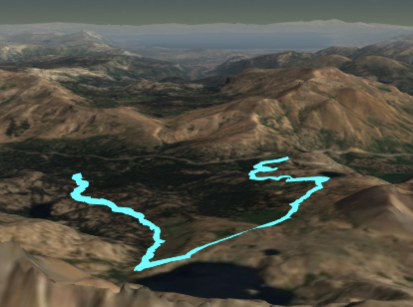

# 3D iPhone Path Viewer

\\(\ddagger\\) [Try it out!](../../../apps/map-viewer) \\(\ddagger\\)
* * *

## Motivation

My family loves to go on hikes in mountainous and scenic locations. Intrigued by the possibilities of localization technology, and realizing that I had a decent position estimator in my pocket, I decided to create a web app that allows you to easily visualize paths you have traversed, all superimposed on a 3D map. With this web app, now I can quickly pull up a visualization of a recently completed adventure on any device with a browser and showcase it to all the participants, which I thoroughly enjoy.

It only took a couple of days to put together, thanks to the wonders of web development libraries (such as [Cesium](https://cesiumjs.org)) readily available for remote access. All I had to do was write the base html environment, rules for Cesium camera view changes, a user interface for uploading and checking csv files, and an algorithm for converting valid csv files to dynamically loadable kml resources.

Besides the slightly niche yet personally satisfying application, this project exposed me more to JavaScript and its role in web development. I find the Node framework to be a provocatively modular and concise tool for app development, and the notion of developing code to run in the browser is becoming increasingly attractive to me for personal projects.

## Usage

This web app is designed to be used with the [Sensor Log](http://sensorlog.berndthomas.net) iOS app, which utilizes the sensor suite on the iPhone to log a wide variety of inertial and other sensor data in csv files.

If you have the app and want to use it with the 3D iPhone Path Viewer, you must ensure that the following is set in the Settings:

1. "csv" is selected for the file output format (not "JSON").
2. The log delimiter must be a comma.
3. Probably make sure that the recording rate isn't too fast (I tend to record with a sampling time of 20 seconds for long walks, 5 seconds for short drives, etc.) to avoid excessively large csv log files.
4. Ensure that the "CL" record field is toggled on. This is the data that the web app will visualize.

Once a csv has been recorded and exported, it can be loaded and visualized directly on the web app page, linked to at the top of this page.

If you don't have the Sensor Log app and want to try the path viewer out anyway, all you need is a csv file with the following format requirements:

1. Comma-delimited.
2. Column labels are in row 1 with the strings "locationLatitude(WGS84)" "locationLongitude(WGS84)" "locationAltitude(m)" (don't include the quotes).
3. Latitude and longitude are given in decimal-degree format.
4. Altitude is given in meters, relative to sea level.

Here's a path I recorded a couple of years ago on a hike to Lake Winnemucca, visualized in my iPhone's browser:

