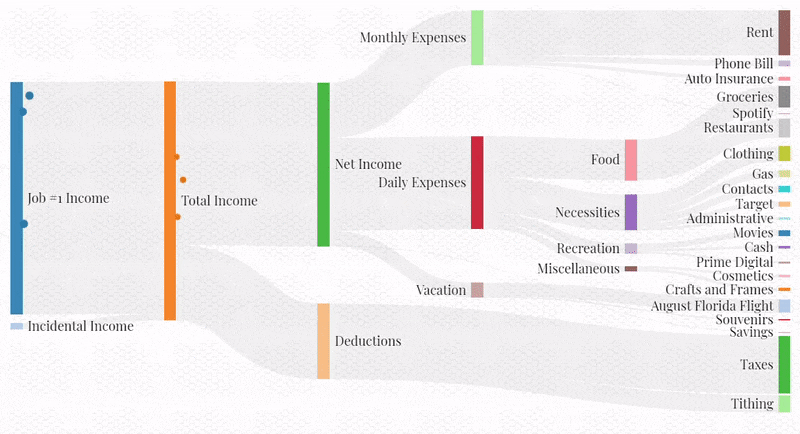

# Budget Visualizer

\\(\ddagger\\) [Try it out!](../../../apps/budget-analyzer) \\(\ddagger\\)
* * *

This project was inspired by a cool post that I saw on [Reddit](https://www.reddit.com/r/dataisbeautiful/comments/adhzrw/watch_my_money_flow_an_animated_representation_of/), as well as by a personal need. I wanted to create a "visual aid" to accompany my standard budgeting spreadsheet that could communicate spending habits in a non-threatening (no numbers, just colors and shapes) and interesting way:

To create the visualization, I modified existing JavaScript code which animates a Sankey diagram loaded from a json file. Most of the work went into writing a script which loads data from my Google Sheets budget and converts it into a Sankey json file.

In general, I can see this project's being useful for visualizing many different processes that can be characterized by acyclic graphs. Some examples may include energy consumption, traffic flow, or even the iterative convergence on an optimal belief state with a non-parametric representation, as with a particle filter or a genetic algorithm.
