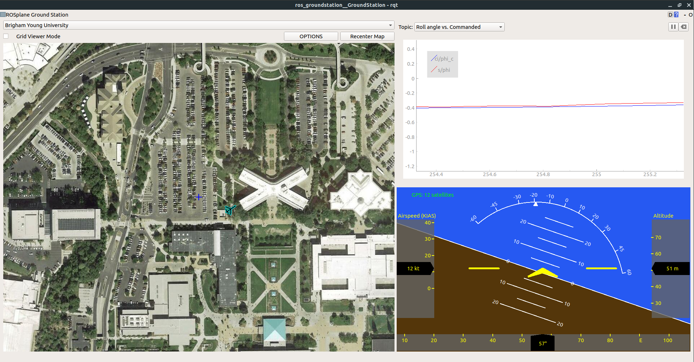

# ROS Ground Station
\\(\ddagger\\) [Link to Github Repository](https://github.com/goromal/ros_groundstation) \\(\ddagger\\)
* * *

In recent years, the Multi-Agent Intelligent Coordination and Control (MAGICC) Lab at Brigham Young University developed a fully functional fixed-wing autopilot called [ROSPlane](https://github.com/byu-magicc/rosplane). As its name suggests, ROSPlane's modular autopilot algorithms (as laid out in *Unmanned Aircraft: Theory and Practice* by Beard & McLain) function as nodes in the Robot Operating System (ROS) distributed computing environment. As such, communication with the autopilot is best carried out over a ROS network, as described [here](http://wiki.ros.org/ROS/NetworkSetup).

Before becoming a member of the MAGICC Lab, I volunteered for a competition team that chose to utilize the fledgling ROSPlane to be the brains of a unmanned air vehicle capable of flying waypoints and capturing visual targets on the ground. As a team, we were limited to communicating with our autopilot over rosservice calls and publish commands via a ground station computer. We lacked the convenience and functionality of a graphical user interface (GUI) such as [Mission Planner](http://ardupilot.org/planner/). I took it upon myself to create a GUI from scratch in Python, akin to Mission Planner, that was easily extendible and built on ROS. Months of work yielded a fully-functional and sleek GUI with the following features:

- **Flight Map:** Using .xml configuration file to specify pre-loaded maps, a drop down menu allows for toggling between satellite views of flight locations. The aircraft is rendered on top of the map, along with contours representing the current path and points representing current waypoints.
- **Configuration Menus:** Pop-Up menus allow for creating waypoints (by clicking on the Flight Map, typing into text fields, or loading from a file), sending them to the aircraft, and changing ROS subscriber parameters in real time.
- **Artificial Horizon:** This window renders a cockpit view of the aircraft's attitude, altitude, and airspeed. Important information regarding GPS connectivity and autopilot status is also displayed.
- **Tuning Plots:** Various plots are available for comparing commanded vs. actual values for Airspeed, Course Angle, Pitch, and Roll. The plots are useful for tuning the inner and outer loops of the longitudinal and lateral autopilots.

Because the GUI runs on ROS, it functions as a useful debugging tool as well as real time ground station. Recorded ROSBags can be played back and entire flights can be re-visualized with this tool. A screenshot of the GUI under typical usage is shown below:



The original ground station was written for ROS Indigo, which only runs on Ubuntu 14.04. I heard word that there were a couple of students at BYU who were trying to adapt my ground station to Ubuntu 16.04, but were not successful. Looking into it myself, I found that the library I was using to render satellite maps was deprecated in 16.04. At the same time, general demand for the ground station in the MAGICC Lab was increasing, which would require and upgrade of the software to 16.04.

After considering my options, I decided that the best long-term solution was to make the GUI as independent from third-party libraries (aside from well-supported Python libraries) as possible. This entailed building my own map management tool using only basic python libraries. This proved to be a fun project in itself, and involved extensive usage of geodesic math and image patching libraries. Below is an example of a function I wrote which creates a map image at a specified latitude, longitude, and zoom level from a bunch of pre-downloaded map tiles:

```python
def fetch_tiles(self):
       # find out which i, j values correspond to each corner
       min_i, max_j = self.localize_point(self.southwest, self.mz_obj.min_latlon, self.mz_obj.max_latlon)
       max_i, min_j = self.localize_point(self.northeast, self.mz_obj.min_latlon, self.mz_obj.max_latlon)

       # fetch and paste images onto a big canvas
       bigsize_x = (max_i - min_i + 1) * TILEWIDTH
       bigsize_y = (max_j - min_j + 1) * TILEHEIGHT
       bigimage = self.new_image(bigsize_x, bigsize_y)

       for i in range(min_i, max_i + 1):
           for j in range(min_j, max_j + 1):
               tile = self.grab_tile(i, j)
               self.paste(bigimage, tile, (i-min_i)*TILEWIDTH, (j-min_j)*TILEHEIGHT)

       upper_left_center = self.mz_obj.tiles[min_i][min_j]
       upper_left_lon = GoogleMapPlotter.pix_to_rel_lon(upper_left_center.lon, int(-TILEWIDTH/2), self.zoom)
       upper_left_lat = GoogleMapPlotter.pix_to_rel_lat(upper_left_center.lat, int(-TILEWIDTH/2), self.zoom)

       self.x_offset = GoogleMapPlotter.rel_lon_to_rel_pix(upper_left_lon, self.west, self.zoom)
       self.y_offset = GoogleMapPlotter.rel_lat_to_rel_pix(upper_left_lat, self.north, self.zoom)

       return bigimage
```

With those final changes, the GUI is now entirely dependent on Python libraries. Porting it over to Ubuntu 18.04 has proved to be a trivial task, and the simplicity of the API has led to its being used in graduate-level courses pertaining to flight dynamics and control, as well as various research projects in the MAGICC Lab.
